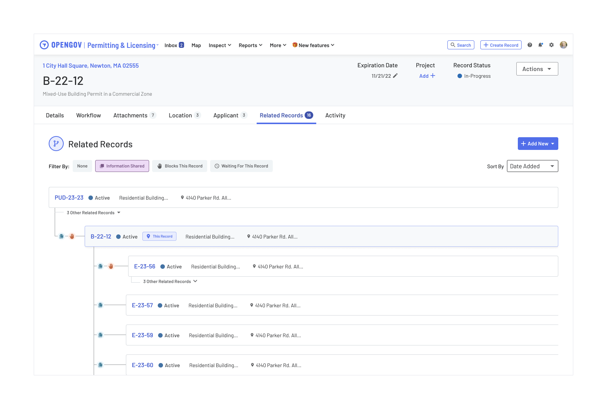

# Chip Component Documentation

## Overview
The Chip component is a versatile UI element used to categorize, filter, or tag content. It supports multiple visual styles and configurations to fit various design needs.

## Variants & Styles
The Chip component has the following variations:


### **Recommended Styles**
- **Default:** For general use
- **Outlined:** For selected/hover states

### **Sizes**
- **Small:** Compact and suitable for dense interfaces.
- **Default:** Balanced size for general use.
- **Large:** Larger for emphasis or touch-friendly interactions.

## Properties
The Chip component supports the following properties:
- **Icon:** A customizable swappable instance that can represent different icons.
- **Avatar:** An optional avatar image that is off by default.
- **Label:** The main textual content of the Chip.
- **Delete Icon:** A customizable swappable instance; defaults to a close button.


In code this would look like:

``` ts
<Chip
    icon={<BellIcon />} 
    label="Notifications"
    deleteIcon={<DeleteIcon />}
    onDelete={handleDelete}
    size="large"
    variant="default"
/>

<Chip
    avatar={<Avatar alt="Leslie Knope" src="../path/to/leslie-knope.jpg" />}
    label="Leslie Knope"
    deleteIcon={<DeleteIcon />}
    onDelete={handleDelete}
    size="large"
    variant="default"
/>
```

## Usage Guidelines
### When to Use
- Use Chips to categorize, filter, or tag content.
- Suitable for adding inline interactive elements.
- Can be used for user selections, such as filtering options in search interfaces.

### When Not to Use
- Avoid using Chips for primary actions (use buttons instead).
- Do not use Chips for long text; keep labels concise.

### Best Practices
- **Ensure readability:** Use the color variant options in the componant.
- **Use consistent spacing:** Maintain uniform padding between Chips.
- **Avoid overuse:** Too many Chips on a screen can cause clutter.
- **Pair with icons when needed:** Icons enhance clarity.

## Examples
### **Tagging System**
- **For tagging content use the default Chip**
- **Choose an appropriate sized Chips allowing for appropriate padding**


### **Filter Options**
- **Use default gray for filter use cases**
- **Use the Icons and Avatars to connote Filter type**


- **Use corresponding colors and Outlined styles for selected states**



### Accessibility Considerations
- **All color variants have been checked for accessibility.**
- **Provide focus indicators for keyboard navigation.**
- **Use aria-labels when necessary for screen readers.**