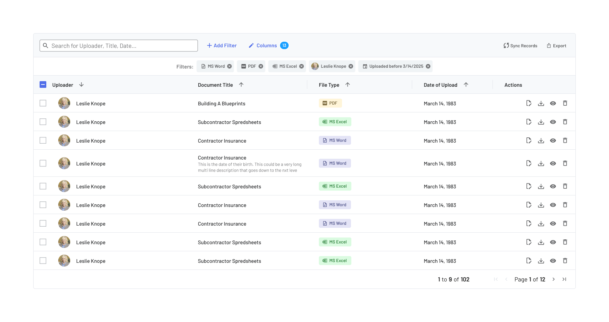

# Chip Component Documentation

## Overview
The Chip component is a versatile UI element used for displaying small pieces of information, such as tags, categories, or interactive elements. It supports multiple visual styles and configurations to fit various design needs.

## Variants & Styles
The Chip component has the following variations:

### 1. **Shape Variants**
- **Rounded:** Soft edges, suitable for modern, friendly UI.
- **Squared:** Sharper edges, ideal for structured or data-heavy interfaces.

### 2. **Color Themes**
- **Light Colors:** 19 predefined light colors.
- **Dark Colors:** 19 predefined strong/dark colors.

### 3. **Border Styles**
- **Bordered:** Has a defined border to enhance visibility.
- **Minimal:** No background, border, or padding for a seamless look.

### 4. **Sizes**
- **Small:** Compact and suitable for dense interfaces.
- **Default:** Balanced size for general use.
- **Large:** Larger for emphasis or touch-friendly interactions.

## Properties
The Chip component supports the following properties:

- **Left Icon:** A customizable swappable instance that can represent different icons.
- **Right Icon:** A customizable swappable instance; defaults to a close button.
- **Avatar:** An optional avatar image that is off by default.
- **Label:** The main textual content of the Chip.

## Usage Guidelines
### When to Use
- Use Chips to categorize, filter, or tag content.
- Suitable for adding inline interactive elements.
- Can be used for user selections, such as filtering options in search interfaces.

### When Not to Use
- Avoid using Chips for primary actions (use buttons instead).
- Do not use Chips for long text; keep labels concise.

### Best Practices
- **Ensure readability:** Choose contrasting colors based on light/dark mode.
- **Use consistent spacing:** Maintain uniform padding between Chips.
- **Avoid overuse:** Too many Chips on a screen can cause clutter.
- **Pair with icons when needed:** Icons enhance clarity, such as an 'X' for removable Chips.

## Examples
### 1. **Tagging System** (Squared, Minimal, Small)
For data dense use cases: 

### 2. **Filter Options** (Rounded, Small, Medium, Monochrome, Bordered)
For filter interaction use cases:

### Accessibility Considerations
- **Ensure sufficient contrast between text and background.**
- **Provide focus indicators for keyboard navigation.**
- **Use aria-labels when necessary for screen readers.**